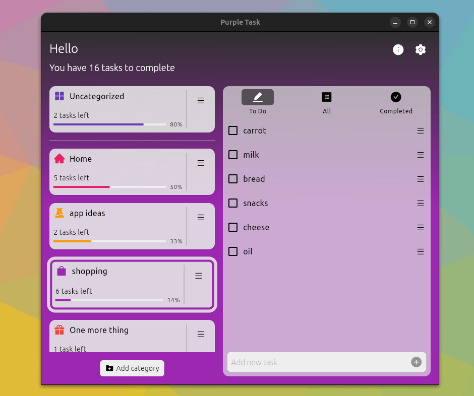
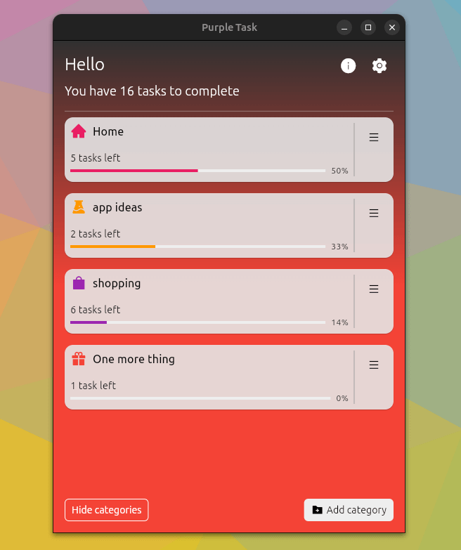
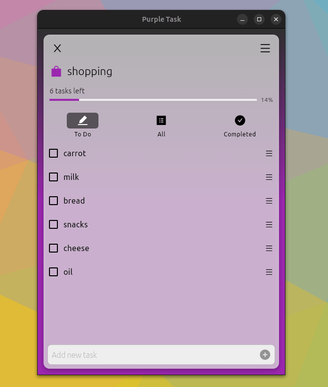
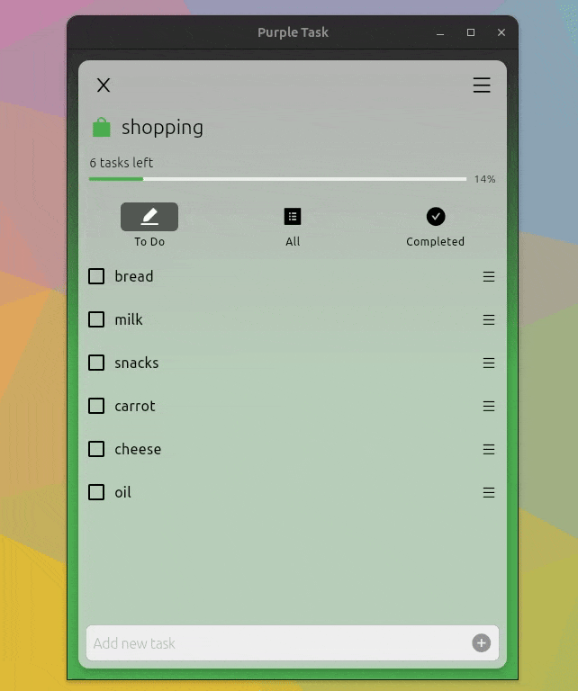

# Purple Task

> Simple TO-DO app to help you get stuff done.


   

---

## Table of Contents

- [Installation](#installation)
- [Screenshots](#screenshots)
- [Video](#video)
- [Contributing](#contributing)
- [Support](#support)
- [License](#license)


---

## Installation

**Option 1**
- Go to the snap store website and download it <a href="https://snapcraft.io/purple-task" target="_blank">here</a>.

**Option 2**
- Or install it through the terminal:
```shell
$ snap install purple-task
```

---

## Screenshots:
- Categories and Task Management










---

## Video


- A quick demo video <a href="https://youtu.be/MtcyOIqV88s" target="_blank">here</a>.

---

## Contributing
- Feel free to report issues or help with existing.
- If you like to help with translation, please [drop me an email](mailto:mivoligo@gmail.com).


---
## Support


- Email: [Contact me](mailto:mivoligo@gmail.com)
- Youtube: <a href="https://www.youtube.com/user/mivoligo" target="_blank">`Mivoligo`</a>


---

## License

- **[MIT license](http://opensource.org/licenses/mit-license.php)**
- Copyright (c) Michał Prędotka
